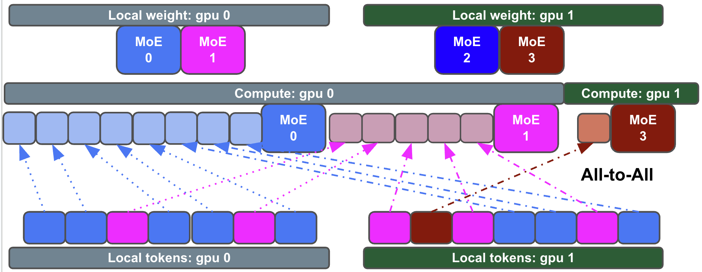
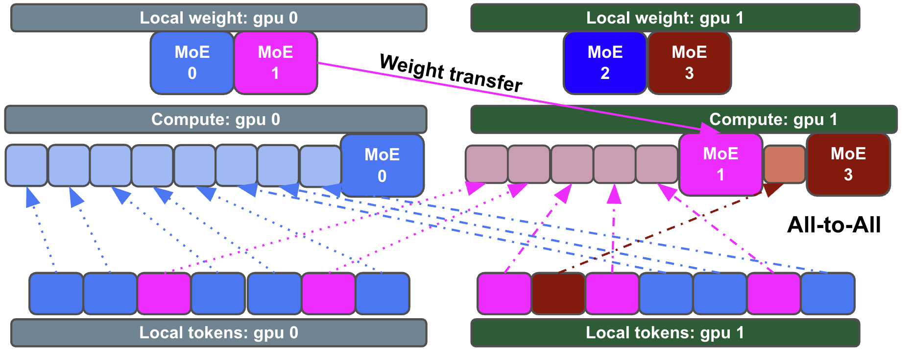
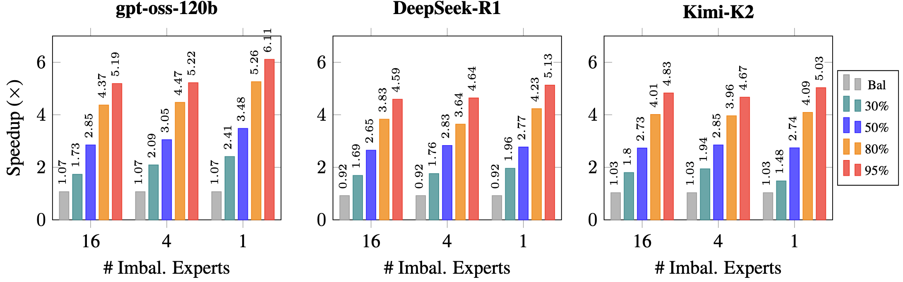
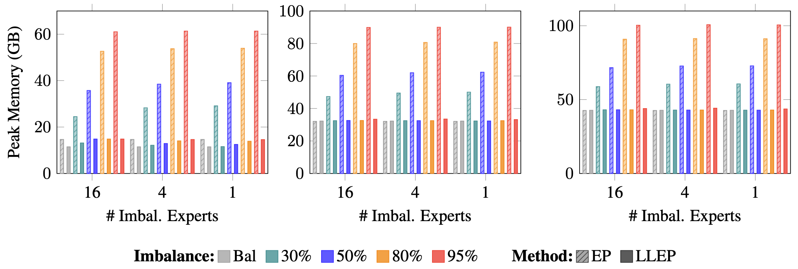

# Least-Loaded Expert Parallelism (LLEP)

[](https://arxiv.org/abs/placeholder)
[](https://huggingface.co/spaces/Salesforce/LeastLoadedEP)
[](./llep_paper.pdf)

> Disclaimer: This repository is provided for research purposes only.


LLEP is an EP algorithm that dynamically reroutes excess tokens—along with their associated expert parameters—from overloaded devices to underutilized ones. It ensures that all devices complete their workloads within the minimum collective latency while respecting memory constraints. LLEP shines when pre-trained MoE models exhibit unpredictable imbalanced routing -- which is often the case even for the most powerful MoE LLMs.

LLEP computes the **exact mathematical computation** of the standard mixture-of-experts, through flexible load routing to different GPUs. It does **NOT** alter the models' logical routing behaviors for the sake of load balancing. LLEP is suitable for post-training and inference, as well as pre-training. LLEP supports gradients and backward pass.

LLEP achieves up to 6× speedup and 4× reduction in peak memory usage compared to standard EP, enabling faster and higher-throughput post-training and inference. 

### Standard EP - Imbalanced expert load may cause inefficiency and GPU memory OOM


### LLEP - Excess loads and weights are spilled from overloaded GPUs to underloaded GPUs


#### Speedup compared to EP across different model configurations


#### Memory Usage: LLEP keep peak memory usage constant, while EP runs the risks of OOM with exploding memory consumption under imbalanced load.



## Usage
####  Simple Test run

```bash
export MOE_ADAPTIVE_LPT_ROUTING_RATIO=1.3
export CUDA_VISIBLE_DEVICES=0,1,2,3,4,5,6,7
python -m torch.distributed.run --nproc_per_node=8 test_llep.py \
    --num_tokens 32768 \
    --hidden_size 2880 \
    --intermediate_size 2880 \
    --num_experts 128 \
    --top_k 4 \
    --max_tokens_factor 1.0 \
    --min_tokens_per_gemm 1024 \
    --imbalance_configs "30:4,50:4,80:4,95:4"
```


## Citation

```bibtex
@misc{llep,
  title={Least-Loaded Expert Parallelism: Load Balancing An Imbalanced Mixture-of-Experts},
  author={Xuan-Phi Nguyen and Shrey Pandit and Austin Xu and Caiming Xiong and Shafiq Joty},
  year={2026},
  primaryClass={cs.AI},
  url={}, 
}
```


